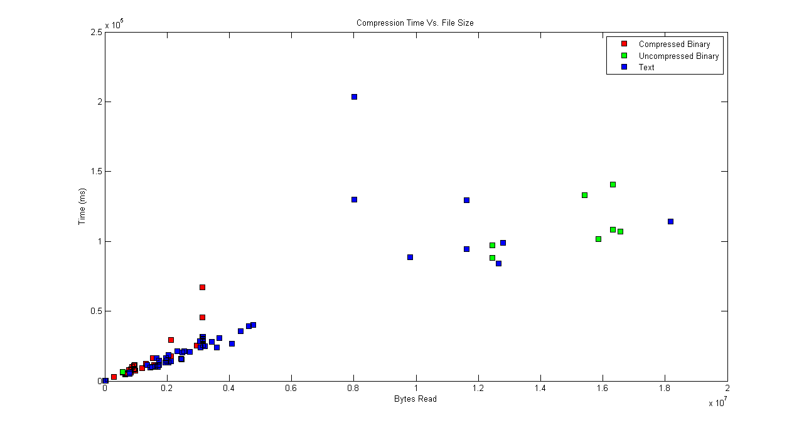
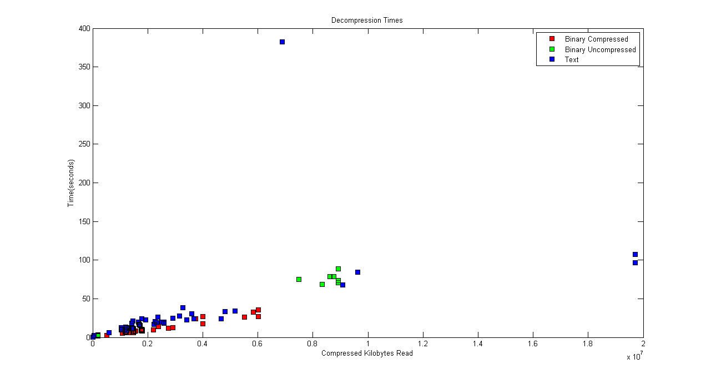
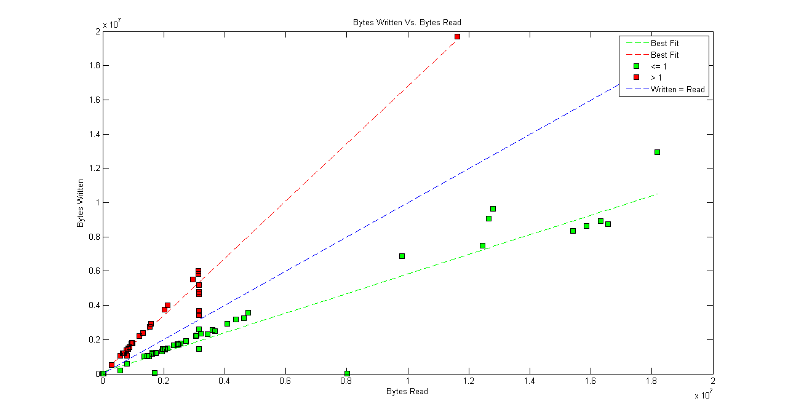
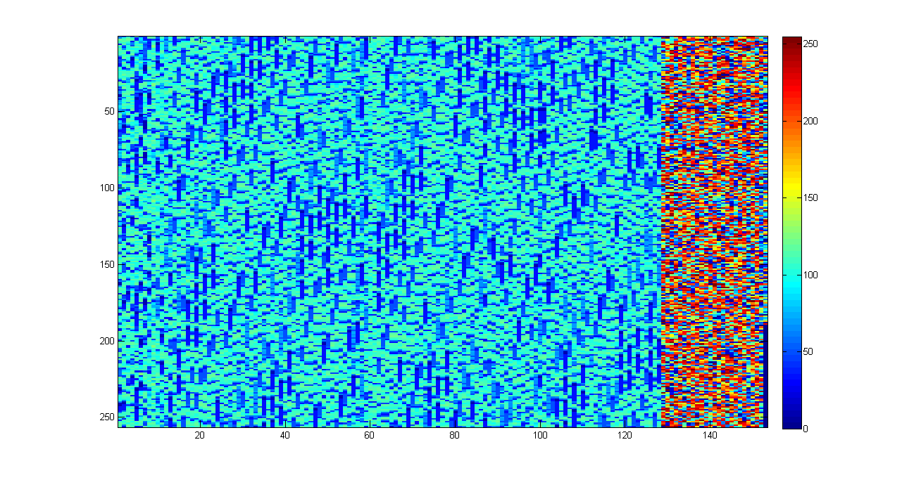

# LZW #

A Java implementation of the Lempel Zif Welsh compression algorithm.

## String compress(InputStream in, OutputStream out) ##

Compress an input stream

Parameter | Description
--------- | -----------
in | The input stream to compress
out | The destination of the compressed bytes

### Returns ###
Statistics of the compression process in the form of:

BytesRead, BytesWritten, Efficiency, Time(ms), DictionarySize

## public String decompress(InputStream in, OutputStream out) ##

Decompress an input stream that was previously encoded using LZW

Parameter | Description
--------- | -----------
in | The input stream to decompress
out | The destination of the decompressed bytes

### Returns ###
Statistics of the decompression process in the form of:

BytesRead, BytesWritten, Efficiency, Time(ms), DictionarySize

# Performance #

## Compression Time ##

## Decompression Time ##

## Compression Ratio ##

